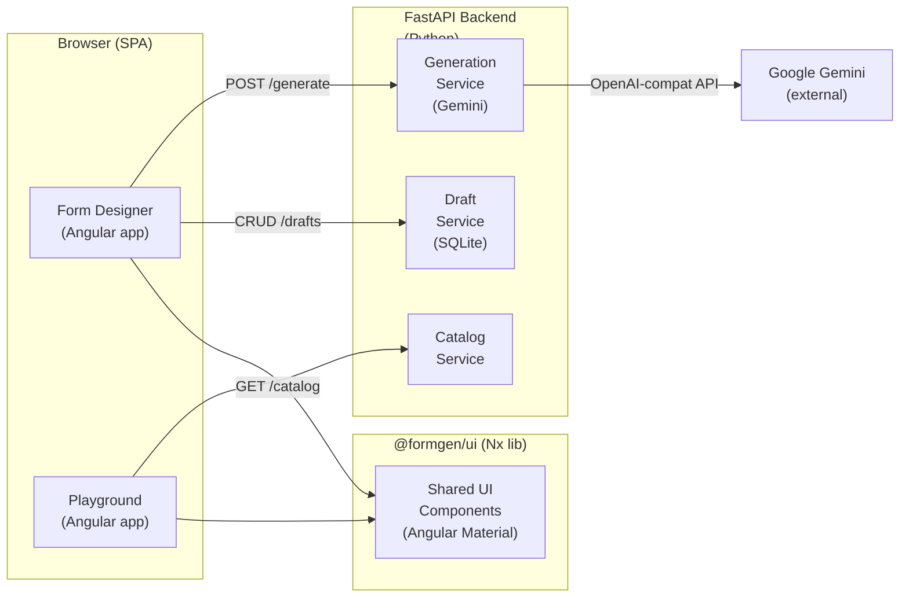
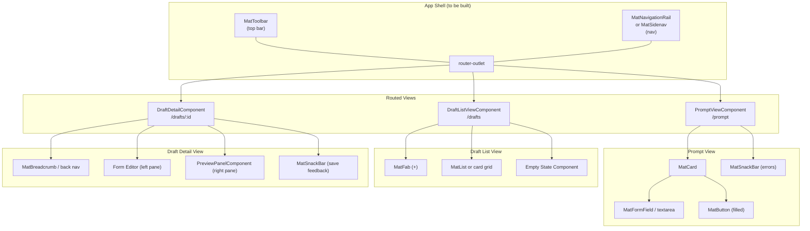

# FormGen UI Enhancement Design Document

> **Status:** Draft — 2026-02-22
> **Scope:** `apps/form-designer` and `apps/playground`
> **Stack:** Angular 21 · Angular Material 21 (Material Design 3) · Nx monorepo

---

## 1. Overview & Goals

The Form Designer app is functional but lacks a coherent app shell, consistent navigation, and several Material Design 3 UX patterns. The Playground app already has a working sidenav shell — the goal is to bring the Form Designer to the same level of polish and extend both apps with accessibility and token-driven theming.

### Success Criteria

- A persistent, responsive app shell (top bar + navigation rail or sidenav) wraps every view.
- All loading, empty, and error states use Material 3 components — no raw `<p>` error messages.
- Color and spacing use MD3 system tokens (`--mat-sys-*`) throughout, with no hard-coded hex values.
- Every interactive element is keyboard-navigable and has ARIA labels.
- Dark mode is supported via `color-scheme: light dark`.

---

## 2. C4 Container Diagram — Existing System



---

## 3. Component Diagram — Form Designer App



---

## 4. Enhancement Areas

### 4.1 App Shell & Navigation

**Current state:** `app.html` contains only `<router-outlet>`. There is no persistent toolbar or navigation. Users have no consistent way to move between views.

**Target:** A minimal app shell with a top `MatToolbar` and a `MatNavigationBar` (bottom, mobile) / navigation rail (desktop). The Playground app (`apps/playground/src/app/app.ts`) already uses `MatToolbarModule` + `MatSidenavModule` — use it as a reference.

#### Checklist

- [ ] Create `AppShellComponent` (or add shell markup directly to `AppComponent`)
  - File: `apps/form-designer/src/app/app.ts` + `app.html`
- [ ] Add `MatToolbarModule` import; render app title ("FormGen") in the top bar
- [ ] Add a `MatIconButton` in the toolbar for the sidenav toggle (mobile only)
- [ ] Implement responsive layout:
  - Mobile (< 960 px): `MatSidenav` in `over` mode, toggle via toolbar button
  - Desktop (≥ 960 px): navigation rail (persistent icon+label links) using `MatNavList` inside a fixed-width side pane
- [ ] Add `RouterLink` nav items: **New Form** (`/prompt`), **My Drafts** (`/drafts`)
- [ ] Highlight the active route using `routerLinkActive="active"` and an `--mat-sys-secondary-container` background token
- [ ] Add a `MatIconButton` in the toolbar for dark mode toggle (updates `color-scheme` on `<body>`)
- [ ] Ensure shell is accessible: `<nav aria-label="Main navigation">`, `role="navigation"`

**Reference:** [angular.dev — Navigation rail](https://material.angular.dev/components/sidenav/overview), [MD3 Navigation Rail](https://m3.material.io/components/navigation-rail/overview)

---

### 4.2 Prompt View (`/prompt`)

**Current state:** Centred `MatCard` with a textarea and a raised button. Errors are raw `<p>` tags inside a `div.prompt-errors`. Loading shows a bare `MatSpinner`.

**Target:** Keep the centred card layout but replace ad-hoc error/loading patterns with Material 3 components.

#### Checklist

- [ ] Replace `mat-raised-button color="primary"` with `mat-flat-button` (MD3 filled button)
  - File: `apps/form-designer/src/app/views/prompt-view/prompt-view.component.html:35`
- [ ] Move error display from `<p class="error-msg">` to a `MatSnackBar` dismissible notification
  - Inject `MatSnackBar` into `PromptViewComponent`
  - Call `snackBar.open(err.message, 'Dismiss', { duration: 5000 })` on error
- [ ] Replace bare `<mat-spinner>` in card actions with a `mat-flat-button` that shows a spinner inside: `<mat-spinner diameter="18"> Generating…`
  - This preserves button width and avoids layout shift
- [ ] Add `aria-busy="true"` on the card while `loading()` is true
- [ ] Add `aria-describedby` linking the textarea to its `<mat-hint>`
- [ ] Add a character count suffix (`<mat-suffix>{{ prompt.length }}/2000</mat-suffix>`) to encourage concise prompts

---

### 4.3 Draft List View (`/drafts`)

**Current state:** A `div.list-header` with an `<h2>` and a raised button, followed by a grid of `MatCard` components. The empty state is a plain `<p>` with an inline link. Delete uses a spinner inside a warn button.

**Target:** Introduce a proper empty state, replace the header button with a FAB, and use a `MatList` or `MatTable` for dense lists.

#### Checklist

- [ ] Replace `mat-raised-button color="primary"` "+ New Form" link in the header with a `mat-fab extended` FAB anchored to the bottom-right corner (mobile) or kept in the toolbar area (desktop)
  - File: `apps/form-designer/src/app/views/draft-list-view/draft-list-view.component.html:4`
- [ ] Create a reusable `EmptyStateComponent` in `libs/ui/src/` (or app-local if not shared):
  - Props: `icon: string`, `heading: string`, `body: string`, `ctaLabel: string`, `ctaRoute: string`
  - Use a large `MatIcon` (96 px), `--mat-sys-outline` color, and a centred `mat-flat-button` CTA
- [ ] Replace `<p class="empty-msg">` with `<app-empty-state>` using the new component
  - File: `apps/form-designer/src/app/views/draft-list-view/draft-list-view.component.html:10`
- [ ] Replace raw `<mat-spinner diameter="16">` inside delete button with `[disabled]` + button-level `aria-label="Deleting…"` and a `mat-progress-bar` below the list (less disruptive)
- [ ] Add a `MatChip` colour for draft status:
  - `saved` → use `--mat-sys-tertiary-container`
  - `draft` → use `--mat-sys-surface-variant`
  - Apply via a CSS class map, not hard-coded colours
- [ ] Sort drafts by `updated_at` descending (most recent first) — confirm API already returns this order; if not, sort in the component
- [ ] Add `aria-label` to card action buttons: `aria-label="Edit {{ draft.name }}"`, `aria-label="Delete {{ draft.name }}"`

---

### 4.4 Draft Detail / Editor View (`/drafts/:id`)

**Current state:** A two-column layout (editor left, preview right) with a back link (`← All Drafts`), a `MatCard` editor, and inline success/error `<p>` messages. Version and status are shown as plain text.

**Target:** Add a proper breadcrumb/back nav, replace inline save feedback with a `MatSnackBar`, and improve the field editor rows.

#### Checklist

- [ ] Replace `← All Drafts` text button with `MatButton` + `MatIcon` using `arrow_back`:
  ```html
  <button mat-icon-button routerLink="/drafts" aria-label="Back to drafts">
    <mat-icon>arrow_back</mat-icon>
  </button>
  ```
  File: `apps/form-designer/src/app/views/draft-detail/draft-detail.component.html:11`
- [ ] Move `✓ Saved successfully` and save errors to `MatSnackBar`:
  - Success: `snackBar.open('Saved', undefined, { duration: 2000, panelClass: 'snack-success' })`
  - Error: `snackBar.open('Save failed: ' + err.message, 'Retry', { duration: 6000 })`
  - File: `apps/form-designer/src/app/views/draft-detail/draft-detail.component.html:66-68, 59-64`
- [ ] Display version and status as `MatChip` elements next to the breadcrumb:
  - `<mat-chip disabled>v{{ draft().version }}</mat-chip>`
  - `<mat-chip [class]="'status-' + draft().status">{{ draft().status }}</mat-chip>`
- [ ] Replace `.field-type-badge` `<span>` with a `MatChip` (non-interactive) for field type display
- [ ] Add drag-and-drop reordering to the fields list using `CdkDragDrop` from `@angular/cdk/drag-drop`
  - This is a medium-complexity enhancement; add `cdkDropList` + `cdkDrag` directives to the `div[formArrayName]` and each `.field-row`
- [ ] Make the two-column split responsive:
  - Desktop (≥ 1024 px): side-by-side (current)
  - Mobile/tablet (< 1024 px): stacked with a `MatTab` toggle ("Edit" / "Preview")
- [ ] Add `aria-label="Form editor"` and `aria-label="Live preview"` to the two panes

---

### 4.5 Playground App

**Current state:** Has a working toolbar + sidenav shell. Components: `CatalogBrowserComponent`, `FormPreviewPanelComponent`, `ThemePickerComponent`.

#### Checklist

- [ ] Align toolbar styling with Form Designer shell once that is built (shared `AppShellComponent` in `libs/ui` if feasible)
- [ ] Add a `MatProgressBar` at the top of the preview panel while `loadingForm()` is true (instead of any spinner inside the panel)
- [ ] Ensure `ThemePickerComponent` persists the selected theme to `localStorage` and restores it on load
- [ ] Add keyboard shortcut (`/`) to focus the catalog search input (`CatalogBrowserComponent`)
- [ ] Add a `MatTooltip` to each catalog item showing the form's description on hover

---

### 4.6 Shared / Library Components (`libs/`)

#### Checklist

- [ ] Audit `@formgen/ui` exports — confirm `PreviewPanelComponent` (used in draft-detail) is exported from the lib and not duplicated in the app
- [ ] Create `EmptyStateComponent` in `libs/ui/src/lib/empty-state/` if it will be shared between Form Designer and Playground
- [ ] Create `StatusChipComponent` in `libs/ui/src/lib/status-chip/` to render draft/form status consistently
- [ ] Add a `LoadingOverlayDirective` (structural) that shows a `MatProgressBar` at the component boundary, replacing scattered `<mat-spinner>` usages

---

## 5. Material Design 3 Token & Theming Guidelines

The global theme is defined in `apps/form-designer/src/styles.scss` using `mat.theme()` with the `$azure-palette` primary colour. All component-level styles **must** use MD3 system tokens instead of hard-coded values.

### Token Reference

| Purpose | Token |
|---|---|
| Page background | `--mat-sys-surface` |
| Card background | `--mat-sys-surface-container` |
| Primary action (filled btn) | `--mat-sys-primary` on `--mat-sys-on-primary` |
| Destructive action | `--mat-sys-error` on `--mat-sys-on-error` |
| Secondary / status chip | `--mat-sys-secondary-container` |
| Tertiary / success chip | `--mat-sys-tertiary-container` |
| Body text | `--mat-sys-on-surface` |
| Subdued / hint text | `--mat-sys-on-surface-variant` |
| Dividers / outlines | `--mat-sys-outline-variant` |
| Elevation (card) | `--mat-sys-shadow` |

### Dark Mode

The `styles.scss` currently sets `color-scheme: light`. To support dark mode:

```scss
body {
  color-scheme: light dark; // defer to OS preference (default)
}
```

For a manual toggle, add a `dark` class to `<body>` and override `color-scheme`:

```scss
body.dark-mode {
  color-scheme: dark;
}
```

The `mat.theme()` mixin automatically generates dark-mode overrides when `color-scheme` supports dark — no extra SCSS is required.

### Checklist

- [ ] Change `color-scheme: light` to `color-scheme: light dark` in `apps/form-designer/src/styles.scss:25` to enable OS-preference dark mode
- [ ] Add the same to `apps/playground/src/styles.scss`
- [ ] Add a manual dark-mode toggle button in the app toolbar (sets `body.dark-mode` class, persists in `localStorage`)
- [ ] Audit all component SCSS files for hard-coded colours (`#`, `rgb(`) and replace with `var(--mat-sys-*)` tokens
- [ ] Add `tertiary` colour to the playground theme (`apps/playground/src/styles.scss`) to match form-designer

---

## 6. Accessibility Checklist

These items apply across all views.

- [ ] All `<button>` and `<a>` elements have discernible text or `aria-label`
- [ ] `MatFormField` labels are always visible (never hidden behind placeholder-only patterns)
- [ ] Focus is trapped in modals/dialogs (`MatDialog` handles this automatically — do not add custom focus traps)
- [ ] Color contrast meets WCAG AA (4.5:1 for text, 3:1 for UI components) — MD3 tokens satisfy this in both light and dark modes by design
- [ ] `mat-spinner` elements have `aria-label` or are wrapped in a container with `aria-live="polite"` and `aria-busy` set appropriately
- [ ] Page-level headings follow a logical hierarchy (`<h1>` once per page, `<h2>` for sections — current views use `<h2>` without a preceding `<h1>`)
- [ ] Keyboard navigation order matches visual order (avoid positive `tabindex`)
- [ ] All icons used purely as decorations have `aria-hidden="true"`; functional icons have `aria-label` on their parent button
- [ ] `routerLink` navigation announces route changes to screen readers — add `LiveAnnouncer` from `@angular/cdk/a11y` in the `AppComponent` listening to `NavigationEnd`

---

## 7. Verification / How to Review

### Viewing this document

Open `design/ui-enhancements.md` in:
- **Obsidian** (configured at `design/.obsidian/`) — Mermaid diagrams render natively
- **VS Code** with the [Markdown Preview Mermaid Support](https://marketplace.visualstudio.com/items?itemName=bierner.markdown-mermaid) extension
- **GitHub** — Mermaid is rendered in `.md` files automatically

### Reviewing Mermaid diagrams

1. Open this file in Obsidian or VS Code preview.
2. Confirm the C4 container diagram (section 2) shows six nodes: two browser apps, two backend services, one external AI service, and one shared lib.
3. Confirm the component diagram (section 3) shows the shell, three routed views, and sub-components for each view.

### Reviewing checklists

- Each checklist item references a specific file path and line number where applicable.
- Items prefixed with `[ ]` are not yet implemented; tick them off as work completes.
- The order within each section is **recommended implementation order** (foundation first, polish last).

### Running the app to verify changes

```bash
# Start the Form Designer dev server
pnpm nx serve form-designer

# Start the Playground dev server
pnpm nx serve playground

# Run e2e tests
pnpm nx e2e form-designer-e2e
```
